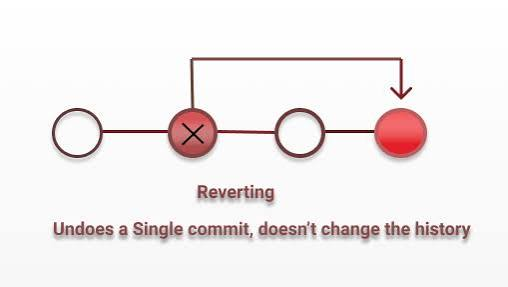
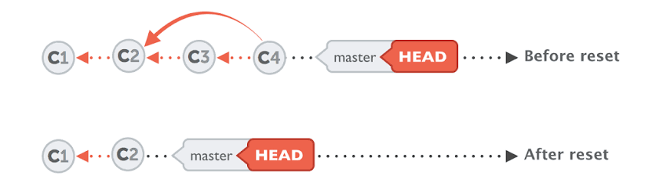

# Git Essentials

---

## Why Git?

- for __Version Control__:
    - __track__ changes in your code
    - instead of having multiple versions locally, change the code and __create separate versions as commits__, stored locally or remotely

- for __Team work__:
    - __Synch__ changes amongs multiple collaborators

## How does it work?

- __Locally__:

    - __Working directory__: where you make changes 
    - __Staging area__: use git add to stage changes
    - __Local repository__: use git commit -m  to save changes

- __Git Provider__:

    - __Remote repository__: 
        - use git push to upload changes to a remote repository
        - use git pull to download changes from a remote repository

## Undoing changes (Stage area)

- Undo staged changes:

    - __Stage__ a file: git add example.txt
    - Check status: git status
    - __Unstage__ the file: git restore --staged example.txt
    - Verify: git status

- Undo changes to a file:

    - __Stage__ a file: git add example.txt
    - __Modify__ a file: example.txt
    - Check status: git status
    - __Revert changes__: git restore example.txt
    - __note__: the file is still in stage area

## Revert

- You're working on a file, then make some changes and commit it
- later you want to undo the changes that were committed
- Use __git log__ to see the commit history
- Find the commit ID (ID of the commit that made the changes)
- Use __git revert COMMIT-ID__
- Important: Revert doesn't delete the commit history. Instead, it creates a new commit that applies the opposite changes.

## Reset

- You're working on a file, then make some changes and commit it
- Later you want to __completely remove__ the commit and go back to before it
- Use __git log__ to see the commit history
- Find the commit ID of the commit you want to go back TO (the one BEFORE the changes)
- Use __git reset COMMIT-ID__

- git reset moves the HEAD pointer backward and deletes the commit history after that point
- Unlike revert, it does not create a new commit
- Use --soft to keep changes staged
- Use --hard to also delete all changes in files (⚠️ dangerous!)

